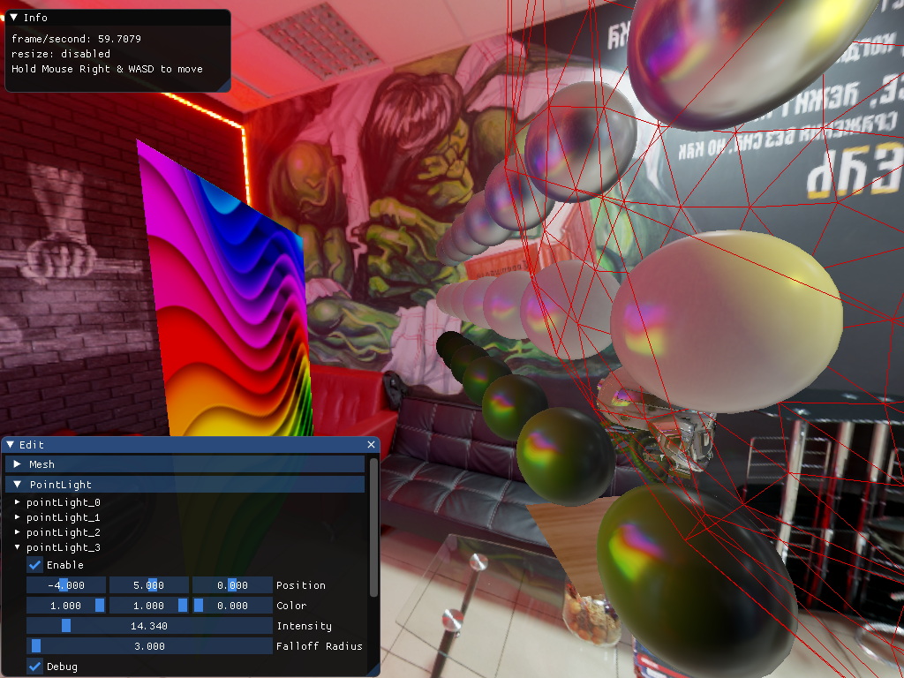

## This is
Created for quick engine and graphics features protyping on Windows only. A spiritual successor of my other project DEngine (https://github.com/norrischiu/DEngine). 

## It has
- PBR render pipeline
- Clustered forward shading
- Linearly transformed cosines area light, based on https://eheitzresearch.wordpress.com/415-2/, with improvements:
1. Uses baked proxy sphere for integration instead of many-branches clipping
2. Uses vector irradiance to sample texture so filtered texture does not require a custom border
- Distant hdr diffuse and specular light probe
- Lock free job system with job stealing
- Pool memory allocator backed container
- SIMD maths library
- Custom asset exporter

## To run
Use Sample/build.bat to generate solution at Sample/Build/, Visual Studio 2017 is required. 

Make sure you have Windows 10 Dev Kit installed and dxc.exe searchable in system path.
